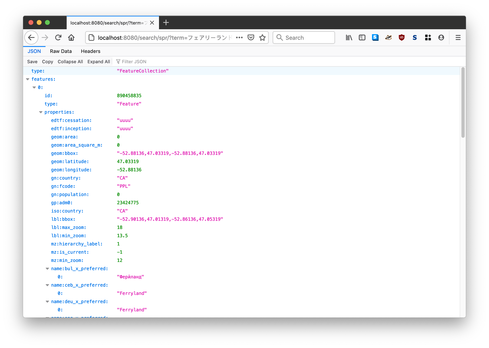
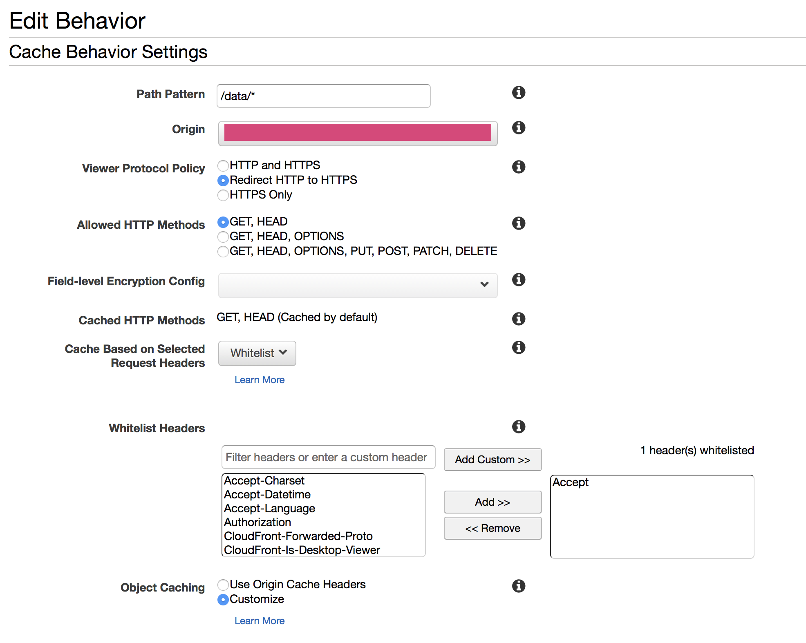

# go-whosonfirst-browser

`go-whosonfirst-browser` is a Go package for browsing and rendering [Who's On First](https://whosonfirst.org/) (WOF) records in a number of formats including HTML, SVG, PNG and GeoJSON.


It uses [Bootstrap](https://getbootstrap.com/) for HTML layouts and [Leaflet](https://leafletjs.com/), [Tangram.js](https://github.com/tangrams/tangram) and [Nextzen](https://nextzen.org) vector tiles for rendering maps. All of these dependencies are bundled with the tool and served locally. With the exception of the vector tiles (which can be cached) and a configurable data source there are no external dependencies.

_This package used to be called `go-whosonfirst-static`. Now it is called `go-whosonfirst-browser.`_

## Things this package is not

### This is not a replacement for the [Who's On First Spelunker](https://spelunker.whosonfirst.org/).

At least not yet.

`go-whosonfirst-browser` was designed to be a simple display tool for known Who's On First (WOF) IDs and records. That constitutes a third to half of [what the Spelunker does](https://github.com/whosonfirst/whosonfirst-www-spelunker) (the remainder being list views and facets) so in principle it would be easy enough to add the same functionality here. Except for the part where the Spelunker is backed by a real search engine (Elasticsearch).

The principle advantage of migrating Spelunker functionality to this package is that it does not have any external dependencies and has support for multiple data sources and caches and can be pre-compiled in to a standalone binary tool. The principle disadvantage would be that experimenting and developing code and functionality in Python (used by the existing Spelunker) has a lower barrier to entry than doing the same in Go (used by this package).

For the time being though they are separate beasts.

### This is not a search engine.

This is a tool that is primarily geared towards displaying _known_ Who's On First IDs. This is slowly changing but by default, it does not maintain an index, or a list of known records, before it displays them.

There is experimental support for data sources that implement the [go-whosonfirst-search fulltext interfaces](https://github.com/whosonfirst/go-whosonfirst-search). As of this writing there is only one such provider: The [go-whosonfirst-search-sqlite](https://github.com/whosonfirst/go-whosonfirst-search-sqlite) package which queries the `search` tables created by the [go-whosonfirst-sqlite-features](https://github.com/whosonfirst/go-whosonfirst-sqlite-features) package (or tools that use it to produce SQLite databases).

It would be easy enough to add flags to use an external instance of the [Pelias Placeholder API](https://millsfield.sfomuseum.org/blog/2019/11/04/placeholder/) for basic search functionality so we'll add that to the list of features for a "2.x" release.

It might also be easy enough to preload a [Bleve](https://github.com/blevesearch/bleve) index, or generate one at runtime depending on the data source and its size, but that is currently out of scope for the project.

### This is not a tool for editing Who's On First documents.

At least not yet.

Interestingly the code that renders Who's On First (WOF) property dictionaries in to pretty HTML tables is the same code used for the experimental Mapzen "[Yes No Fix](https://whosonfirst.org/blog/2016/04/08/yesnofix/) project". That functionality has not been enabled or tested with this tool yet.

On the other hand editing anything besides simple key-value pairs means identifying all the complex types, defining rules for how and when they can be updated (or added) and then maintaining all the code to do that. These are all worthwhile efforts but they are equally complex and not things this tool aims to tackle right now.

If you'd like to read more about the subject of editing Who's On First documents have a look at:

* Dan Phiffer's blog posts about the [Boundary Issues editing tool](https://whosonfirst.org/blog/tags/boundaryissues/).
* Gary Gale's [Three Steps Backwards, One Step Forwards; a Tale of Data Consistency and JSON Schema](https://whosonfirst.org/blog/2018/05/25/three-steps-backwards/).

## Tools

To build binary versions of these tools run the `cli` Makefile target. For example:

```
$> make cli
go build -mod vendor -o bin/whosonfirst-browser cmd/whosonfirst-browser/main.go
```

### whosonfirst-browser

```
> ./bin/whosonfirst-browser -h
  -authenticator-uri string
    	A valid sfomuseum/go-http-auth URI. (default "null://")
  -cache-uri string
    	A valid go-cache Cache URI string. (default "gocache://")
  -cors-origin value
    	One or more hosts to restrict CORS support to on the API endpoint. If no origins are defined (and -cors is enabled) then the server will default to all hosts.
  -enable-all
    	Enable all the available output handlers EXCEPT the search handlers which need to be explicitly enable using the -enable-search* flags.
  -enable-cors
    	A boolean flag to enable CORS headers (default true)
  -enable-data
    	Enable the 'geojson' and 'spr' and 'select' output handlers.
  -enable-geojson
    	Enable the 'geojson' output handler. (default true)
  -enable-geojson-ld
    	Enable the 'geojson-ld' output handler. (default true)
  -enable-graphics
    	Enable the 'png' and 'svg' output handlers.
  -enable-html
    	Enable the 'html' (or human-friendly) output handlers. (default true)
  -enable-index
    	Enable the 'index' (or human-friendly) index handler. (default true)
  -enable-navplace
    	Enable the IIIF 'navPlace' output handler. (default true)
  -enable-png
    	Enable the 'png' output handler.
  -enable-search
    	Enable both the API and human-friendly search handlers.
  -enable-search-api
    	Enable the (API) search handlers.
  -enable-search-api-geojson
    	Enable the (API) search handlers to return results as GeoJSON.
  -enable-search-html
    	Enable the (human-friendly) search handlers.
  -enable-select
    	Enable the 'select' output handler.
  -enable-spr
    	Enable the 'spr' (or "standard places response") output handler. (default true)
  -enable-svg
    	Enable the 'svg' output handler.
  -enable-webfinger
    	Enable the 'webfinger' output handler.	
  -exporter-uri string
    	A valid whosonfirst/go-whosonfirst-export/v2 URI. (default "whosonfirst://")
  -github-accesstoken-uri string
    	A valid gocloud.dev/runtimevar URI that resolves to a GitHub API access token, required if you are using a githubapi:// reader URI.
  -map-provider string
    	Valid options are: nextzen, protomaps (default "nextzen")
  -navplace-max-features int
    	The maximum number of features to allow in a /navplace/{ID} URI string. (default 3)
  -nextzen-api-key string
    	A valid Nextzen API key (https://developers.nextzen.org/).
  -nextzen-style-url string
    	A valid Tangram scene file URL. (default "/tangram/refill-style.zip")
  -nextzen-tile-url string
    	A valid Nextzen MVT tile URL. (default "https://tile.nextzen.org/tilezen/vector/v1/512/all/{z}/{x}/{y}.mvt")
  -nextzen-tilepack-database string
    	The path to a valid MBTiles database (tilepack) containing Nextzen MVT tiles.
  -nextzen-tilepack-uri string
    	The relative URI to serve Nextzen MVT tiles from a MBTiles database (tilepack). (default "/tilezen/vector/v1/512/all/{z}/{x}/{y}.mvt")
  -path-geojson string
    	The path that GeoJSON requests should be served from. (default "/geojson/")
  -path-geojson-alt value
    	Zero or more alternate paths that GeoJSON requests should be served from.
  -path-geojson-ld string
    	The path that GeoJSON-LD requests should be served from. (default "/geojson-ld/")
  -path-geojson-ld-alt value
    	Zero or more alternate paths that GeoJSON-LD requests should be served from.
  -path-id string
    	The URL that Who's On First documents should be served from. (default "/id/")
  -path-navplace string
    	The path that IIIF navPlace requests should be served from. (default "/navplace/")
  -path-navplace-alt value
    	Zero or more alternate paths that IIIF navPlace requests should be served from.
  -path-png string
    	The path that PNG requests should be served from. (default "/png/")
  -path-png-alt value
    	Zero or more alternate paths that PNG requests should be served from.
  -path-protomaps-tiles string
    	The root path from which Protomaps tiles will be served. (default "/tiles/")
  -path-search-api string
    	The path that API 'search' requests should be served from. (default "/search/spr/")
  -path-search-html string
    	The path that API 'search' requests should be served from. (default "/search/")
  -path-select string
    	The path that 'select' requests should be served from. (default "/select/")
  -path-select-alt value
    	Zero or more alternate paths that 'select' requests should be served from.
  -path-spr string
    	The path that SPR requests should be served from. (default "/spr/")
  -path-spr-alt value
    	Zero or more alternate paths that SPR requests should be served from.
  -path-svg string
    	The path that SVG requests should be served from. (default "/svg/")
  -path-svg-alt value
    	Zero or more alternate paths that SVG requests should be served from.
  -path-webfinger string
    	The path that 'webfinger' requests should be served from. (default "/.well-known/webfinger/")
  -path-webfinger-alt value
    	Zero or more alternate paths that 'webfinger' requests should be served from.	
  -protomaps-bucket-uri string
    	A valid gocloud.dev/blob.Bucket URI containing Protomaps tile databases.
  -protomaps-cache-size int
    	The size in MB of the Protomaps tile cache. (default 64)
  -protomaps-tiles-database string
    	The name of the Protomaps tiles database to use.
  -proxy-tiles
    	Proxy (and cache) Nextzen tiles.
  -proxy-tiles-cache whosonfirst/go-cache
    	A valid whosonfirst/go-cache URI. (default "gocache://")
  -proxy-tiles-timeout int
    	The maximum number of seconds to allow for fetching a tile from the proxy. (default 30)
  -proxy-tiles-url string
    	The URL (a relative path) for proxied tiles. (default "/tiles/")
  -reader-uri value
    	One or more valid go-reader Reader URI strings.
  -search-database-uri string
    	A valid whosonfirst/go-whosonfist-search/fulltext URI.
  -select-pattern string
    	A valid regular expression for sanitizing select parameters. (default "properties(?:.[a-zA-Z0-9-_]+){1,}")
  -server-uri string
    	A valid aaronland/go-http-server URI. (default "http://localhost:8080")
  -static-prefix string
    	Prepend this prefix to URLs for static assets.
```

#### Example

```
$> bin/whosonfirst-browser \
	-enable-all -nextzen-api-key {NEXTZEN_APIKEY} \
	-reader-uri {READER_URI}
	
2019/12/14 18:22:16 Listening on http://localhost:8080
```

Then if you visited `http://localhost:8080/id/101736545` in your web browser you would see this:


By default Who's On First (WOF) properties are rendered as nested (and collapsed) trees but there is are handy `show raw` and `show pretty` toggles for viewing the raw WOF GeoJSON data.

##### Protomaps


Other examples include reading data from two different sources and using [Protomaps](https://protomaps.com) as a map tile provider:

```
$> bin/whosonfirst-browser/main.go \
	-enable-all \
	-reader-uri repo:///usr/local/data/sfomuseum-data-architecture \
	-reader-uri repo:///usr/local/data/sfomuseum-data-whosonfirst \
	-map-provider protomaps \
	-protomaps-bucket-uri file:///usr/local/data/ \
	-protomaps-tiles-database sfo

2022/11/11 22:29:05 Listening on http://localhost:8080
```

The `-protomaps-bucket-uri` is expected to be a valid [gocloud.dev/blob](https://gocloud.dev/howto/blob/) bucket URI. Only the [gocloud `fileblob` provider](https://gocloud.dev/howto/blob/#local) for accessing files on the local filesystem is enabled by default. If you need to enable other providers you will need to clone the [cmd/whosonfirst-browser/main.go](cmd/whosonfirst-browser/main.go) tool and add the relevant `import` statements. See the [Data sources and Caches](#data-sources-and-caches) section for examples.

##### Tailscale


Or all of those things but running the application as a [Tailscale virtual private service](https://tailscale.com/blog/tsnet-virtual-private-services/): 

```
$> bin/whosonfirst-browser/main.go \
	-enable-all \
	-reader-uri repo:///usr/local/data/sfomuseum-data-architecture \
	-reader-uri repo:///usr/local/data/sfomuseum-data-whosonfirst \
	-map-provider protomaps \
	-protomaps-bucket-uri file:///usr/local/data/ \
	-protomaps-tiles-database sfo
	-server-uri 'tsnet://whosonfirst:80?auth-key={TAILSCALE_AUTH_KEY}'

2022/11/11 22:25:47 Listening on http://whosonfirst:80
```

Please consult the documentation for [aaronland/go-http-tsnet](https://github.com/aaronland/go-http-server-tsnet) for details on running `whosonfirst-browser` as a virtual private service.

## Map providers

`whosonfirst-provider` supports two map tile providers.

### Nextzen

By default, `whosonfirst-browser` uses [Nextzen](https://nextzen.org/) vector data tiles and the [Tangram.js](https://github.com/tangrams/tangram) rendering library for displaying maps. The Tangram code and styling assets are bundled with this tool and served directly but, by default, tile data is retrieved from the Nextzen servers.

It is possible to cache those tiles locally using the `-proxy-tiles` flag at start up. The default cache for proxying tiles is an ephemiral in-memory cache but you can also specify an alternative [go-cache](https://github.com/whosonfirst/go-cache) `cache.Cache` source using the `-proxy-tiles-cache` flag. Caches are discussed in detail below.

You will need a [valid Nextzen API key](https://developers.nextzen.org/) in order for map tiles to work. 

#### Parameters (command line flags)

| Name | Value | Required | Notes |
| --- | --- | --- | --- |
| nextzen-api-key | string | yes | A valid Nextzen developer API key. |
| nextzen-style-url | string no | A valid Tangram scene file URL. Default is `/tangram/refill-style.zip` |
| nextzen-tile-url string |  no | A valid Nextzen MVT tile URL. Default is `https://tile.nextzen.org/tilezen/vector/v1/512/all/{z}/{x}/{y}.mvt` |
| nextzen-tilepack-uri | string | no | The relative URI to serve Nextzen MVT tiles from a MBTiles database (tilepack). Default is `/tilezen/vector/v1/512/all/{z}/{x}/{y}.mvt` |
| proxy | bool | no | Proxy (and cache) Nextzen tiles. Default is false. |
| proxy-tiles-cache string | string | no | A valid `whosonfirst/go-cache` URI. Default is `gocache://` |
| proxy-tiles-timeout | int | no | The maximum number of seconds to allow for fetching a tile from the proxy. Default is 30. |
| proxy-tiles-url | string | no | The URL (a relative path) for proxied tiles. Default is `/tiles` |

### Protomaps

It is possible to configure `whosonfirst-browser` to use [Protomaps](https://protomaps.com) to serve and render tiles for display maps. To do so pass the `-map-provider protomaps` flag at startup along with the other required Protomap-related flags.

#### Parameters (command line flags)

| Name | Value | Required | Notes |
| --- | --- | --- | --- |
| protomaps-bucket-uri | string | yes | A valid `gocloud.dev/blob.Bucket` URI. |
| protomaps-tiles-database | string | yes | The name of the PMTiles database to serve tiles from. This name should not have the `.pmtiles` extension but it will be silently removed if it does. |
| path-protomaps-tiles | string | no | The relative root URI from which PMTiles will be served. Default is `/tiles/` |

As of this writing I haven't figured out how to support custom Protomaps styles yet. You can create custom Protomaps tiles databases, for small geographic areas, using the [Create Small Map](https://protomaps.com/downloads/small_map) on the [protomaps.com](https://protomaps.com/) website.


### Fallback

If no map provider is defined, or if not Nextzen API key is defined, then the browser tool will display the SVG rendering for a place's geometry. For example:


## Output formats

The following output formats are available.

### GeoJSON

A raw Who's On First (WOF) GeoJSON document. For example:


`http://localhost:8080/geojson/101736545`

### HTML

A responsive HTML table and map for a given WOF ID. For example:


`http://localhost:8080/id/101736545`

### (IIIF) navPlace

Returns a WOF record as a GeoJSON `FeatureCollection` document. This enables WOF records to be included in [IIIF navPlace](https://preview.iiif.io/api/navplace_extension/api/extension/navplace/) records as "reference" objects. For example:


`http://localhost:8080/navplace/102527513`

You can specify multiple `Feature` records to include in a response by passing a comma-separated list of IDs. For example:

`http://localhost:8080/navplace/102527513,85922583,85688637`

_Note: There is a limit on the number of records that may be specified which is set by the `-navplace-max-features` flag._

### PNG

A PNG-encoded representation of the geometry for a given WOF ID. For example:


`http://localhost:8080/png/101736545`

#### WebFinger

A JSON-encoded WebFinger ([RFC 7033](https://www.rfc-editor.org/rfc/rfc7033)) respresentation for a record.


`http://localhost:8080/.well-known/webfinger/?resource=acct:101736545`

_Note: WebFinger representations should still be considered a work-in-progress. It's not clear yet whether, or where, there are instance-specific gotchas that will be need to be accounted for, particularly involving host names. It stands to reason that there so this is a "starting point" to work through remaining issues in code._

#### HTML

A responsive HTML form for querying search terms and displaying the results as a list.


`http://localhost:8080/search/?term=مونتريال`

#### "API"

A machine-readable endpoint for querying search terms and results the results as [standard places results](#) (SPR).


`http://localhost:8080/search/spr/?term=ferryland`



If the `-enable-search-api-geojson` flags is enabled then you can also return results as a GeoJSON `FeatureCollection` by passing the `?format=geojson` query parameter.

`http://localhost:8080/search/spr/?term=フェアリーランド&format=geojson`

#### Notes

* As of this writing the "search" endpoints lack pagination.

* The rules by which terms are queried are governed by the Go package that implements the `go-whosonfirst-search.FullTextDatabase` interface, as defined by the `-search-database-uri` flag.

* In order to support GeoJSON output the search handler depends a data source for looking up GeoJSON records. By default this is assumed to be the provider defined by the `-data-source` flag.

* As of this writing only one package implements the [go-whosonfirst-search](https://github.com/whosonfirst/go-whosonfirst-search) interfaces necessary for enabling fulltext search. It is [go-whosonfirst-browser-sqlite](https://github.com/whosonfirst/go-whosonfirst-browser-sqlite).

### "Select"

A JSON-encoded slice of a Who's On First (WOF) GeoJSON document matching a query pattern. For example:


`http://localhost:8080/select/101736545?select=properties.wof:concordances`

`select` parameters should conform to the [GJSON path syntax](https://github.com/tidwall/gjson/blob/master/SYNTAX.md).

As of this writing multiple `select` parameters are not supported. `select` parameters that do not match the regular expression defined in the `-select-pattern` flag (at startup) will trigger an error.
 
### SPR (Standard Places Response)

A JSON-encoded "standard places response" for a given WOF ID. For example:


`http://localhost:8080/spr/101736545`

### SVG

An XML-encoded SVG representation of the geometry for a given WOF ID.  For example:


`http://localhost:8080/svg/101736545`

## Data sources and Caches

The `go-whosonfirst-browser` uses the [go-reader](https://github.com/whosonfirst/go-reader) `reader.Reader` and [go-cache](https://github.com/whosonfirst/go-cache) `cache.Cache` interfaces for reading and caching data respectively. This enables the "guts" of the code to be developed and operate independently of any individual data source or cache.

Readers and caches alike are instantiated using the `reader.NewReader` or `cache.NewCache` methods respectively. In both case the methods are passed a URI string indicating the type of instance to create. For example, to create a local filesystem based reader, you would write:

```
import (
       "github.com/whosonfirst/go-reader"
)

r, _ := reader.NewReader("fs:///usr/local/data")
fh, _ := r.Read("/123/456/78/12345678.geojson")
```

The base `go-reader` package defines a small number of default "readers". Others types of readers are kept in separate packages and loaded as-need. Similar to the way the Go language `database/sql` package works these readers announce themselves to the -reader` package when they are initialized. For example, if you wanted to use a [Go Cloud](https://gocloud.dev/howto/blob/) `Blob` reader you would do something this:

```
import (
       "github.com/whosonfirst/go-reader"
       _ "github.com/whosonfirst/go-reader-blob"       
)

r, _ := reader.NewReader("s3://{S3_BUCKET}?region={S3_REGION}&prefix=data")
fh, _ := r.Read("/123/456/78/12345678.geojson")
```

The same principles appy to caches.

The default `whosonfirst-browser` tool allows data sources to be specified as a localfile system or a remote HTTP(S) endpoint and caching sources as a local filesystem or an ephemiral in-memory lookup.

This is what the code for default `whosonfirst-browser` tool looks like, with error handling omitted for the sake of brevity:

```
package main

import (
	"context"
	_ "github.com/whosonfirst/go-reader-whosonfirst-data"
	"github.com/whosonfirst/go-whosonfirst-browser/v5"
)

func main() {
	ctx := context.Background()
	browser.Start(ctx)
}
```

The default settings for `go-whosonfirst-browser` are to fetch data from the [https://github.com/whosonfirst-data](https://github.com/whosonfirst-data) repositories using the [go-reader-whosonfirst-data](https://github.com/whosonfirst/go-reader-whosonfirst-data) package and to cache those looks in an ephemeral in-memory [go-cache](https://github.com/patrickmn/go-cache) cache.

If you wanted, instead, to read data from the local filesystem you would start the browser like this:

```
$> bin/whosonfirst-browser -enable-all \
	-reader-source 'fs:///usr/local/data/whosonfirst-data-admin-us/data' \
	-nextzen-api-key {NEXTZEN_APIKEY}	
```

Or if you wanted to cache WOF records to the local filesystem you would start the browser like this:

```
$> bin/whosonfirst-browser -enable-all \
	-cache-source 'fs:///usr/local/cache/whosonfirst' \
	-nextzen-api-key {NEXTZEN_APIKEY}	
```

The browser tool will work with any WOF-like data including records outside of the "[core](https://github.com/whosonfirst-data)" dataset. For example this is how you might use the browser tool with the [SFO Museum architecture dataset](https://millsfield.sfomuseum.org/blog/2018/08/28/whosonfirst/):

```
$> bin/whosonfirst-browser -enable-all \
	-reader-source 'fs:///usr/local/data/sfomuseum-data-architecture/data' \
	-nextzen-api-key {NEXTZEN_APIKEY}	
```

And then if you went to `http://localhost:8080/id/1159554801` in your browser you would see:


The "guts" of the application live in the `application/browser` package. This is by design to make it easy (or easier, at least) to create derivative browser tools that use custom readers or caches.

For example if you wanted to create a browser that read files using the [Go Cloud Blob package](https://gocloud.dev/howto/blob/) you would write:

```
// cmd/blob-browser/main.go
package main

import (
	"context"
	_ "github.com/whosonfirst/go-reader-blob"
	"github.com/whosonfirst/go-whosonfirst-browser/v5/application/browser"
)

func main() {
	ctx := context.Background()
	app, _ := browser.NewBrowserApplication(ctx)
	app.Run(ctx)
}
```

And then you would start the browser tool like this:

```
$> bin/blob-browser -enable-all \
	-reader-source 's3://{BUCKET}?region={REGION}' \
	-nextzen-api-key {NEXTZEN_APIKEY}

2019/12/18 08:44:15 Listening on http://localhost:8080
```

### The default `go-reader` implementations that are bundled with this package are:

* https://github.com/whosonfirst/go-reader
* https://github.com/whosonfirst/go-reader-cachereader
* https://github.com/whosonfirst/go-reader-findingaid
* https://github.com/whosonfirst/go-reader-github

### See also

* [List of available go-reader.Reader implementations](https://github.com/whosonfirst/go-reader#available-readers)
* [List of available go-cache.Cache implementations](https://github.com/whosonfirst/go-cache#available-caches)

## Lambda

Yes, it is possible to run `browser` as an AWS Lambda function.

To create the Lambda function you're going to upload to AWS simply use the handy `lambda` target in the Makefile. This will create a file called `deployment.zip` which you will need to upload to AWS (those details are out of scope for this document).

Your `wof-staticd` function should be configured with (Lambda) environment variables. Environment variables map to the standard command line flags as follows:

* The command line flag is upper-cased
* All instances of `-` are replaced with `_`
* Each flag is prefixed with `BROWSER`

For example the command line flag `-protocol` would be mapped to the `BROWSER_PROTOCOL` environment variable. Which is a good example because it is the one environment variable you _must_ to specify for `wof-staticd` to work as a Lambda function. Specifically you need to define the `server-uri` as... "lambda://". For example

```
BROWSER_SERVER_URI = lambda://
```

Minimal viable Lambda environment variables:

| Name | Value | Notes |
| --- | --- | --- |
| BROWSER_ENABLE_ALL | true | You don't have to enable all outputs, it's just the easiest example |
| BROWSER_NEXTZEN_API_KEY| *** | You can signup for a Nextzen API key at [developers.nextzen.org](https://developers.nextzen.org/) |
| BROWSER_READER_SOURCE | https://data.whosonfirst.org | |
| BROWSER_SERVER_URI | lambda://?binary_type=image/png&binary_type=application/zip | The query parameters are necessary if you want output images (see below). |

### Lambda, API Gateway and images

In order for requests to produce PNG output (rather than a base64 encoded string) you will need to do a few things.

1. Make sure your API Gateway settings list `image/png` as a known and valid binary type:


2. If you've put a CloudFront distribution in front of your API Gateway then you
will to ensure that you blanket enable all HTTP headers or whitelist the
`Accept:` header , via the `Cache Based on Selected Request Headers` option (for
the CloudFront behaviour that points to your gateway):

2a. **Or:** Don't use a custom whitelist (in your behaviour settings) but make sure you pass a custom header in your origin settings (see `3a` for details).



3. Make sure you pass an `Accept: image/png` header when you request the PNG rendering.

3a. **Or:** make sure you specify a `Origin Custom Headers` header in your CloudFront origin settings (specifically `Accept: image/png`)

## Docker

[Yes](Dockerfile). For example:

```
$> docker build -t whosonfirst-browser .
...
```

And then:

```
$> docker run -it -p 8080:8080 whosonfirst-browser \
	/usr/local/bin/whosonfirst-browser \
	-server-uri 'http://0.0.0.0:8080' \
	-enable-all \
	-nextzen-api-key {NEXTZEN_APIKEY}
	
2019/12/17 16:27:04 Listening on http://0.0.0.0:8080
```

## See also

* https://github.com/whosonfirst/go-whosonfirst-findingaid
* https://github.com/whosonfirst/go-reader
* https://github.com/whosonfirst/go-reader-findingaid
* https://github.com/whosonfirst/go-cache
* https://github.com/whosonfirst/go-whosonfirst-search
* https://github.com/aaronland/go-http-bootstrap
* https://github.com/aaronland/go-http-tangramjs
* https://github.com/aaronland/go-http-server
* https://github.com/aaronland/go-http-server-tsnet
* https://github.com/sfomuseum/go-http-tilezen
* https://github.com/sfomuseum/go-http-protomaps
* https://github.com/protomaps/go-pmtiles
* https://github.com/sfomuseum/go-sfomuseum-pmtiles
* https://github.com/whosonfirst/go-whosonfirst-svg
* https://github.com/whosonfirst/go-whosonfirst-image
